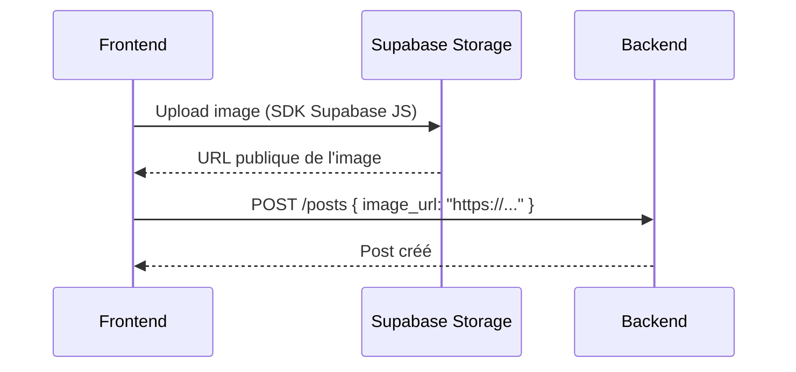

# Référence API — Agun

## Informations Générales

| Propriété | Valeur |
|-----------|--------|
| **Base URL** | `http://localhost:8000/api/v1` (dev) |
| **Format** | JSON |
| **Auth** | Bearer Token (JWT Supabase) |
| **Documentation interactive** | `http://localhost:8000/docs` (Swagger) |

### Authentification

Toutes les routes (sauf celles marquées 🔓) nécessitent le header :

```
Authorization: Bearer <jwt_token>
```

Le token JWT est obtenu via Supabase Auth lors de la connexion.

### Codes de réponse

| Code | Signification |
|------|---------------|
| `200` | Succès |
| `201` | Ressource créée |
| `400` | Requête invalide (données manquantes ou malformées) |
| `401` | Non authentifié (token absent ou expiré) |
| `403` | Non autorisé (token valide mais droits insuffisants) |
| `404` | Ressource non trouvée |
| `422` | Erreur de validation des données |
| `500` | Erreur interne du serveur |

---

## Légende des statuts

| Icône | Signification |
|-------|---------------|
| ✅ | Implémenté et fonctionnel |
| 🚧 | En cours d'implémentation |
| ❌ | À implémenter |
| 🔓 | Route publique (pas de token requis) |

---

## Auth — `/auth`

### `POST /auth/register` 🔓 ❌

Créer un nouveau compte utilisateur.

**Body :**
```json
{
  "email": "amara@example.com",
  "password": "MotDePasse123!",
  "full_name": "Amara Diallo"
}
```

**Réponse `201` :**
```json
{
  "access_token": "eyJhbGci...",
  "token_type": "bearer",
  "user": {
    "id": "uuid",
    "email": "amara@example.com",
    "full_name": "Amara Diallo"
  }
}
```

---

### `POST /auth/login` 🔓 ❌

Connecter un utilisateur existant.

**Body :**
```json
{
  "email": "amara@example.com",
  "password": "MotDePasse123!"
}
```

**Réponse `200` :**
```json
{
  "access_token": "eyJhbGci...",
  "token_type": "bearer",
  "user": {
    "id": "uuid",
    "email": "amara@example.com",
    "full_name": "Amara Diallo"
  }
}
```

---

### `POST /auth/logout` ❌

Invalider la session courante.

**Réponse `200` :**
```json
{
  "message": "Déconnexion réussie"
}
```

---

### `POST /auth/refresh` 🔓 ❌

Renouveler le token d'accès avec un refresh token.

**Body :**
```json
{
  "refresh_token": "eyJhbGci..."
}
```

**Réponse `200` :**
```json
{
  "access_token": "eyJhbGci...",
  "token_type": "bearer"
}
```

---

## Utilisateurs — `/users`

### `GET /users/me` ✅

Récupérer le profil de l'utilisateur connecté.

**Réponse `200` :**
```json
{
  "id": "uuid",
  "email": "amara@example.com",
  "username": "amara_diallo",
  "full_name": "Amara Diallo",
  "avatar_url": "https://...",
  "bio": "Étudiant sénégalais à Paris",
  "country_of_origin": "Sénégal",
  "country_of_residence": "France",
  "city": "Paris",
  "skills": ["Informatique", "Football"],
  "is_mentor": false,
  "created_at": "2026-01-15T10:00:00Z"
}
```

---

### `PUT /users/me` ✅

Mettre à jour son propre profil.

**Body (tous les champs sont optionnels) :**
```json
{
  "full_name": "Amara Koné Diallo",
  "bio": "Ingénieur logiciel passionné par l'Afrique",
  "country_of_origin": "Sénégal",
  "country_of_residence": "France",
  "city": "Lyon",
  "skills": ["Python", "React", "Football"],
  "is_mentor": true
}
```

**Réponse `200` :** Profil mis à jour (même format que `GET /users/me`)

---

### `GET /users/{user_id}` ❌

Consulter le profil public d'un autre membre.

**Paramètres :**
- `user_id` (path) : UUID de l'utilisateur

**Réponse `200` :** Profil public (sans données sensibles)

---

## Feed / Posts — `/posts`

> ⚠️ Ces endpoints sont à implémenter côté backend.

---

### `GET /posts` 🔓 ❌

Récupérer le fil d'actualité (liste des posts).

**Query params :**
| Param | Type | Défaut | Description |
|-------|------|--------|-------------|
| `skip` | int | `0` | Pagination : offset |
| `limit` | int | `20` | Pagination : nombre de résultats (max 50) |
| `category` | string | - | Filtrer par catégorie (`experience`, `question`, `conseil`, `annonce`) |

**Réponse `200` :**
```json
[
  {
    "id": "uuid",
    "content": "Je viens d'arriver à Paris, des conseils pour la CAF ?",
    "image_url": null,
    "category": "question",
    "likes_count": 12,
    "created_at": "2026-05-10T14:30:00Z",
    "author": {
      "id": "uuid",
      "username": "amara_diallo",
      "full_name": "Amara Diallo",
      "avatar_url": "https://...",
      "country_of_origin": "Sénégal",
      "city": "Paris"
    },
    "comments_count": 5
  }
]
```

---

### `POST /posts` ❌

Créer un nouveau post.

**Body :**
```json
{
  "content": "Conseil pour trouver un logement étudiant à Paris rapidement...",
  "category": "conseil",
  "image_url": "https://storage.supabase.co/..."
}
```

**Règles :**
- `content` : obligatoire, max 2000 caractères
- `category` : obligatoire, valeur parmi `experience`, `question`, `conseil`, `annonce`
- `image_url` : optionnel, URL issue de Supabase Storage

**Réponse `201` :** Post créé (même format que dans la liste)

---

### `GET /posts/{post_id}` 🔓 ❌

Récupérer un post avec ses commentaires.

**Réponse `200` :**
```json
{
  "id": "uuid",
  "content": "...",
  "category": "question",
  "likes_count": 12,
  "created_at": "...",
  "author": { ... },
  "comments": [
    {
      "id": "uuid",
      "content": "Essaie l'AFER, c'est rapide !",
      "created_at": "...",
      "author": { ... }
    }
  ]
}
```

---

### `DELETE /posts/{post_id}` ❌

Supprimer son propre post.

**Règle :** Seul l'auteur peut supprimer son post.

**Réponse `200` :**
```json
{
  "message": "Post supprimé"
}
```

---

### `POST /posts/{post_id}/like` ❌

Aimer ou retirer son like d'un post (toggle).

**Réponse `200` :**
```json
{
  "liked": true,
  "likes_count": 13
}
```

---

### `POST /posts/{post_id}/comments` ❌

Ajouter un commentaire à un post.

**Body :**
```json
{
  "content": "Merci pour le conseil, très utile !"
}
```

**Réponse `201` :** Commentaire créé.

---

## Événements — `/events`

> ⚠️ Ces endpoints sont à implémenter côté backend.

---

### `GET /events` 🔓 ❌

Lister les événements à venir.

**Query params :**
| Param | Type | Défaut | Description |
|-------|------|--------|-------------|
| `skip` | int | `0` | Pagination |
| `limit` | int | `20` | Résultats par page |
| `city` | string | - | Filtrer par ville |
| `country` | string | - | Filtrer par pays |

**Réponse `200` :**
```json
[
  {
    "id": "uuid",
    "title": "Soirée Afro-Beat — Paris",
    "description": "Grande soirée musicale avec DJs africains...",
    "image_url": "https://...",
    "location": "120 rue de la Roquette, Paris",
    "city": "Paris",
    "country": "France",
    "event_date": "2026-06-15T20:00:00Z",
    "link": "https://billetreduc.com/...",
    "participants_count": 47,
    "creator": {
      "id": "uuid",
      "full_name": "Kofi Mensah",
      "avatar_url": "https://..."
    }
  }
]
```

---

### `POST /events` ❌

Créer un événement.

**Body :**
```json
{
  "title": "Meetup Diaspora Tech — Lyon",
  "description": "Rencontre des professionnels africains de la tech à Lyon.",
  "location": "Station C, 14 rue Sébastien Gryphe, Lyon",
  "city": "Lyon",
  "country": "France",
  "event_date": "2026-07-05T18:00:00Z",
  "link": "https://meetup.com/..."
}
```

**Réponse `201` :** Événement créé.

---

### `GET /events/{event_id}` 🔓 ❌

Récupérer un événement avec ses participants.

**Réponse `200` :** Détail de l'événement + liste des participants.

---

### `POST /events/{event_id}/participate` ❌

S'inscrire ou se désinscrire d'un événement (toggle).

**Réponse `200` :**
```json
{
  "participating": true,
  "participants_count": 48
}
```

---

## Utilitaires

### `GET /health` 🔓 ✅

Vérifier que le backend est opérationnel.

**Réponse `200` :**
```json
{
  "status": "ok"
}
```

---

## Upload de Médias

Les images (avatars, photos de posts, visuels d'événements) sont uploadées **directement sur Supabase Storage** depuis le frontend, sans passer par le backend.



**Buckets Supabase Storage :**
| Bucket | Usage | Accès |
|--------|-------|-------|
| `avatars` | Photos de profil | Public |
| `posts` | Images des posts | Public |
| `events` | Visuels des événements | Public |

---

*Document maintenu par l'équipe technique — Dernière mise à jour : Mai 2026*
