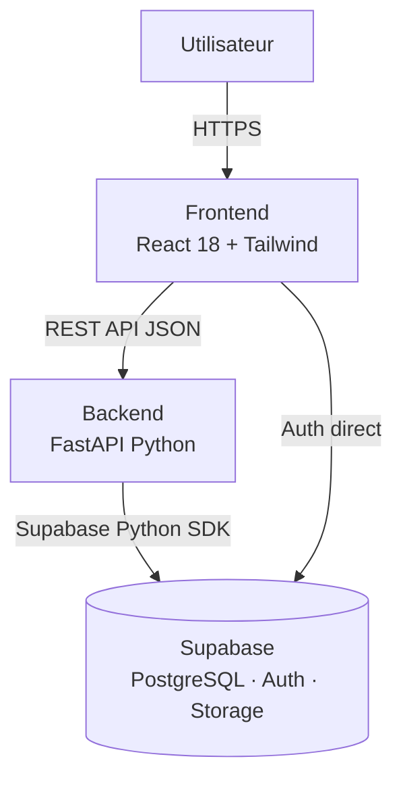
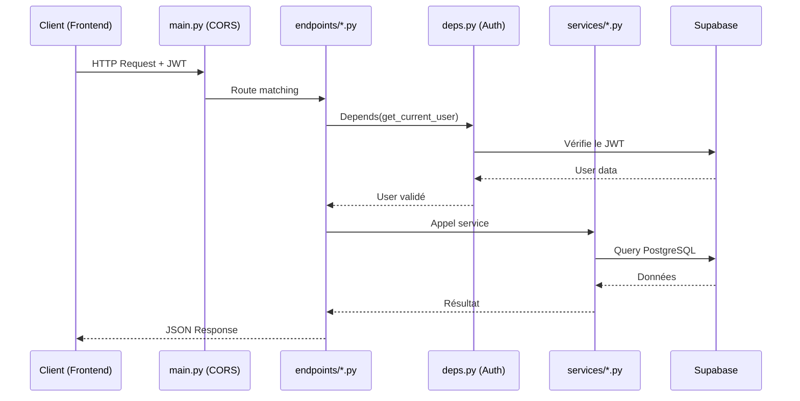
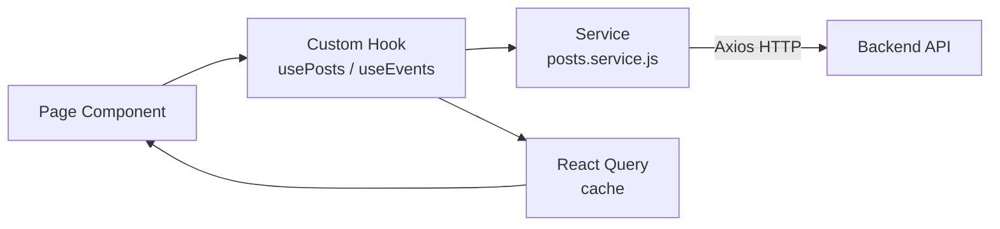
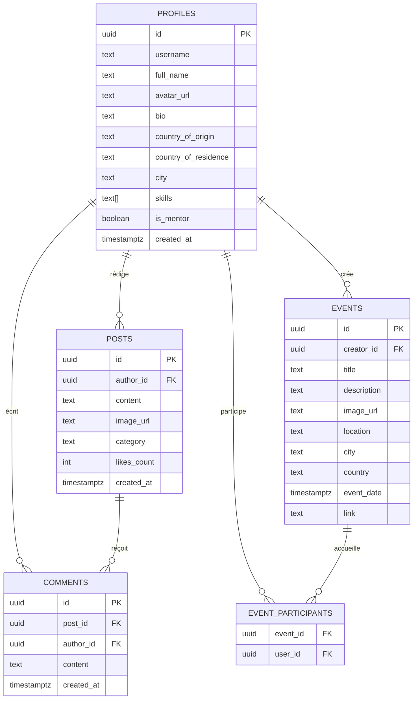

# Architecture Technique — Agun

## Vue d'ensemble

Agun est une application **full-stack** avec une architecture séparée frontend / backend, reliée à **Supabase** comme couche de données et d'authentification.



---

## Stack Technique

### Backend

| Technologie | Version | Rôle |
|-------------|---------|------|
| **Python** | 3.11+ | Langage |
| **FastAPI** | 0.104+ | Framework API REST async |
| **Uvicorn** | 0.24+ | Serveur ASGI |
| **Supabase-py** | 1.2+ | Client Supabase (DB + Auth + Storage) |
| **Pydantic** | 2.5+ | Validation des données, schémas |
| **python-jose** | 3.x | Décodage / vérification JWT |
| **passlib + bcrypt** | latest | Hachage de mots de passe |
| **python-dotenv** | latest | Gestion des variables d'environnement |

### Frontend

| Technologie | Version | Rôle |
|-------------|---------|------|
| **React** | 18.2 | Framework UI |
| **Vite** | latest | Bundler / dev server |
| **Tailwind CSS** | 3.3 | Styling utility-first |
| **React Router** | v6 | Routing côté client |
| **React Query** | v3 | Fetching, cache, état serveur |
| **Axios** | latest | Client HTTP |
| **React Hook Form** | latest | Gestion des formulaires |
| **Zod** | latest | Validation des schémas |
| **Supabase JS** | latest | Client Supabase direct (Auth) |
| **date-fns** | latest | Manipulation des dates |
| **lucide-react** | latest | Icônes |
| **react-hot-toast** | latest | Notifications |

### Infrastructure

| Service | Rôle |
|---------|------|
| **Supabase** | Base de données PostgreSQL managée, Auth, Storage |
| **Vercel / Netlify** | (prévu) Hébergement frontend |
| **Railway / Render** | (prévu) Hébergement backend |

---

## Structure du Projet

```
Agun_web/
├── backend/                    # API FastAPI
│   ├── app/
│   │   ├── api/
│   │   │   └── v1/
│   │   │       ├── endpoints/  # Définition des routes HTTP
│   │   │       │   ├── auth.py        # Login, Register, Logout
│   │   │       │   ├── users.py       # CRUD utilisateurs
│   │   │       │   ├── posts.py       # Feed, posts, commentaires (à créer)
│   │   │       │   └── events.py      # Événements (à créer)
│   │   │       └── api.py      # Routeur principal v1
│   │   ├── core/
│   │   │   ├── config.py       # Variables d'environnement
│   │   │   ├── security.py     # JWT, hachage
│   │   │   ├── database.py     # Initialisation Supabase
│   │   │   └── deps.py         # Dépendances FastAPI (get_current_user, etc.)
│   │   ├── schemas/            # Modèles Pydantic (validation I/O)
│   │   │   ├── user.py
│   │   │   ├── post.py         # À créer
│   │   │   └── event.py        # À créer
│   │   ├── services/           # Couche accès données (Supabase)
│   │   │   ├── database.py     # Service CRUD générique
│   │   │   ├── user_service.py
│   │   │   ├── post_service.py  # À créer
│   │   │   └── event_service.py # À créer
│   │   ├── models/             # Modèles de domaine Python
│   │   └── main.py             # Point d'entrée, configuration CORS
│   ├── requirements.txt
│   └── .env.example
│
├── frontend/                   # Application React
│   ├── src/
│   │   ├── pages/              # Composants de page (= routes)
│   │   │   ├── Auth/           # Login, Register, ForgotPassword
│   │   │   ├── Feed/           # Fil d'actualité (à créer)
│   │   │   ├── Events/         # Liste + Détail événement (à créer)
│   │   │   ├── Profile/        # Profil utilisateur
│   │   │   └── Dashboard/      # Tableau de bord
│   │   ├── components/         # Composants réutilisables
│   │   │   ├── ui/             # Boutons, Inputs, Cards, Modals
│   │   │   ├── feed/           # PostCard, PostForm, CommentList (à créer)
│   │   │   └── events/         # EventCard, EventForm (à créer)
│   │   ├── services/           # Appels API (axios)
│   │   │   ├── api.js          # Instance axios configurée
│   │   │   ├── auth.service.js
│   │   │   ├── posts.service.js  # À créer
│   │   │   └── events.service.js # À créer
│   │   ├── context/            # État global React Context
│   │   │   ├── AuthContext.jsx
│   │   │   └── NotificationContext.jsx
│   │   ├── hooks/              # Custom hooks
│   │   │   ├── useAuth.js
│   │   │   ├── usePosts.js     # À créer
│   │   │   └── useEvents.js    # À créer
│   │   ├── routes/             # Configuration React Router
│   │   └── utils/              # Helpers, validateurs, constantes
│   ├── package.json
│   └── .env.example
│
└── docs/                       # Documentation
    ├── VISION.md
    ├── ARCHITECTURE.md
    ├── SETUP.md
    └── API.md
```

---

## Architecture Backend — Flux d'une Requête



**Règle :** Ne jamais appeler Supabase directement depuis les endpoints. Toujours passer par un service.

---

## Architecture Frontend — Flux des Données



**Règle :** Les composants ne font jamais d'appels HTTP directement. Tout passe par les services.

---

## Modèle de Données (Supabase / PostgreSQL)



---

## Conventions de Code

### Backend (Python / FastAPI)

- **Nommage :** `snake_case` pour tout (variables, fonctions, fichiers)
- **Schémas :** Un schéma `Create`, `Update`, et `Response` par ressource
- **Services :** Méthodes `async` uniquement
- **Erreurs :** Toujours lever des `HTTPException` avec des messages clairs
- **Auth :** Toute route protégée utilise `Depends(get_current_active_user)`

```python
# Exemple de route correcte
@router.get("/posts", response_model=list[PostResponse])
async def get_posts(
    current_user: User = Depends(get_current_active_user),
    skip: int = 0,
    limit: int = 20
):
    return await post_service.get_all(skip=skip, limit=limit)
```

### Frontend (React / JavaScript)

- **Nommage :** `camelCase` pour les variables/fonctions, `PascalCase` pour les composants
- **Fichiers :** Un composant par fichier, nom = nom du composant
- **State :** `useState` pour l'état local, `React Query` pour l'état serveur, `Context` pour l'état global
- **Styles :** Tailwind uniquement (pas de CSS inline)
- **Pas de `useEffect` pour les appels API** — utiliser React Query

```jsx
// Exemple de composant correct
const PostCard = ({ post }) => {
  const { mutate: likePost } = useLikePost();
  
  return (
    <div className="bg-white rounded-lg shadow p-4">
      <p>{post.content}</p>
      <button onClick={() => likePost(post.id)}>
        ❤️ {post.likes_count}
      </button>
    </div>
  );
};
```

---

## Sécurité

- Toutes les routes API (sauf `/auth/login` et `/auth/register`) nécessitent un token JWT.
- Le token est envoyé dans le header : `Authorization: Bearer <token>`
- Les secrets (clés Supabase, SECRET_KEY) ne sont jamais committés dans le repo — utiliser `.env`.
- Le CORS doit être restreint aux origines connues en production (pas `*`).

---

*Document maintenu par l'équipe technique — Dernière mise à jour : Mai 2026*
