# Schéma de Base de Données — Agun

## Vue d'Ensemble

Base de données : **PostgreSQL** hébergée sur **Supabase**.

Tous les IDs sont des `UUID` générés côté base de données.
Les dates sont en `TIMESTAMPTZ` (timezone UTC).
Les compteurs (`likes_count`, `followers_count`, etc.) sont dénormalisés pour les performances de lecture du feed.

---

## Diagramme Entité-Relation

```mermaid
erDiagram
    PROFILES ||--o{ PROFILE_ORIGINS : "a plusieurs"
    PROFILES ||--o{ PROFILE_NATIONALITIES : "a plusieurs"
    PROFILES ||--o{ PROFILE_ETHNICITIES : "a plusieurs"
    PROFILES ||--o{ PROFILE_SKILLS : "possède"
    PROFILES ||--o{ PROFILE_INTERESTS : "a comme intérêts"
    PROFILES ||--o{ POSTS : "rédige"
    PROFILES ||--o{ COMMENTS : "écrit"
    PROFILES ||--o{ EVENTS : "crée"
    PROFILES ||--o{ EVENT_PARTICIPANTS : "participe à"
    PROFILES ||--o{ FOLLOWS : "suit"
    PROFILES ||--o{ CONNECTIONS : "se connecte à"
    PROFILES ||--o{ MESSAGES : "envoie"
    PROFILES ||--o{ SERVICES : "propose"
    PROFILES ||--o{ MENTORING_PROFILES : "devient mentor"
    PROFILES ||--o{ MENTORING_REQUESTS : "demande"
    PROFILES ||--o{ NOTIFICATIONS : "reçoit"
    PROFILES ||--o{ REPORTS : "signale"
    PROFILES ||--o{ BLOCKED_USERS : "bloque"

    POSTS ||--o{ COMMENTS : "reçoit"
    POSTS ||--o{ POST_LIKES : "reçoit"
    POSTS ||--o{ POST_SAVES : "sauvegardé par"
    POSTS ||--o{ POST_HASHTAGS : "taggé"
    HASHTAGS ||--o{ POST_HASHTAGS : "utilisé dans"

    CONVERSATIONS ||--o{ CONVERSATION_PARTICIPANTS : "implique"
    CONVERSATIONS ||--o{ MESSAGES : "contient"

    SERVICES ||--o{ SERVICE_REVIEWS : "reçoit"
    SERVICES ||--o{ SERVICE_IMAGES : "illustré par"

    EVENTS ||--o{ EVENT_PARTICIPANTS : "accueille"
    EVENTS ||--o{ EVENT_UPDATES : "publie"

    MENTORING_PROFILES ||--o{ MENTORING_REQUESTS : "reçoit"
    MENTORING_REQUESTS ||--o{ MENTORING_REVIEWS : "évaluée par"
```



---

## Tables Détaillées

---

### AUTH (géré par Supabase)

> Supabase gère automatiquement la table `auth.users` avec email, mot de passe hashé, confirmation email, sessions JWT. Nous ne la redéfinissons pas.

---

### PROFILES

Table principale des profils utilisateurs.

```sql
CREATE TABLE profiles (
  id                   UUID PRIMARY KEY REFERENCES auth.users(id) ON DELETE CASCADE,
  username             TEXT UNIQUE NOT NULL,              -- @handle, ex: "amara_diallo"
  full_name            TEXT NOT NULL,
  avatar_url           TEXT,
  cover_url            TEXT,                             -- photo de couverture
  bio                  TEXT CHECK (length(bio) <= 300),

  -- Statut de vie
  status               TEXT NOT NULL CHECK (status IN (
                          'étudiant', 'travailleur', 'entrepreneur',
                          'freelance', 'sans_emploi', 'retraité'
                        )),

  -- Localisation actuelle
  country_of_residence TEXT NOT NULL,
  city                 TEXT NOT NULL,

  -- Infos professionnelles / académiques (selon statut)
  job_title            TEXT,
  company              TEXT,
  sector               TEXT,
  field_of_study       TEXT,
  university           TEXT,
  study_year           TEXT,
  study_country        TEXT,

  -- Préférences
  preferred_language   TEXT DEFAULT 'fr',
  is_public            BOOLEAN DEFAULT TRUE,
  show_ethnicity       BOOLEAN DEFAULT FALSE,
  show_city            BOOLEAN DEFAULT TRUE,
  show_employer        BOOLEAN DEFAULT FALSE,
  allow_messages_from  TEXT DEFAULT 'connections' CHECK (
                          allow_messages_from IN ('everyone', 'followers', 'connections')
                        ),

  -- Mentor
  is_mentor            BOOLEAN DEFAULT FALSE,

  -- Compteurs dénormalisés (mis à jour via triggers)
  followers_count      INT DEFAULT 0,
  following_count      INT DEFAULT 0,
  connections_count    INT DEFAULT 0,
  posts_count          INT DEFAULT 0,

  -- Modération
  is_active            BOOLEAN DEFAULT TRUE,
  suspension_until     TIMESTAMPTZ,
  ban_reason           TEXT,

  created_at           TIMESTAMPTZ DEFAULT NOW(),
  updated_at           TIMESTAMPTZ DEFAULT NOW()
);

CREATE INDEX idx_profiles_username ON profiles(username);
CREATE INDEX idx_profiles_country_residence ON profiles(country_of_residence);
CREATE INDEX idx_profiles_city ON profiles(city);
CREATE INDEX idx_profiles_status ON profiles(status);
```

---

### PROFILE_ORIGINS

Pays d'origine d'un utilisateur (multi-valeurs).

```sql
CREATE TABLE profile_origins (
  profile_id UUID REFERENCES profiles(id) ON DELETE CASCADE,
  country    TEXT NOT NULL,
  is_primary BOOLEAN DEFAULT FALSE,     -- pays d'origine principal
  PRIMARY KEY (profile_id, country)
);
```

---

### PROFILE_NATIONALITIES

Nationalités d'un utilisateur (multi-valeurs).

```sql
CREATE TABLE profile_nationalities (
  profile_id  UUID REFERENCES profiles(id) ON DELETE CASCADE,
  nationality TEXT NOT NULL,
  PRIMARY KEY (profile_id, nationality)
);
```

---

### PROFILE_ETHNICITIES

Ethnicités d'un utilisateur (multi-valeurs, optionnel et privé par défaut).

```sql
CREATE TABLE profile_ethnicities (
  profile_id UUID REFERENCES profiles(id) ON DELETE CASCADE,
  ethnicity  TEXT NOT NULL,            -- ex: "Wolof", "Peul", "Yoruba"
  community  TEXT,                     -- ex: "Diaspora sénégalaise de France"
  PRIMARY KEY (profile_id, ethnicity)
);
```

---

### SKILLS (Référentiel global)

```sql
CREATE TABLE skills (
  id       UUID PRIMARY KEY DEFAULT gen_random_uuid(),
  name     TEXT UNIQUE NOT NULL,       -- ex: "Python", "Cuisine africaine"
  category TEXT                        -- ex: "tech", "gastronomie", "finance"
);
```

### PROFILE_SKILLS

```sql
CREATE TABLE profile_skills (
  profile_id UUID REFERENCES profiles(id) ON DELETE CASCADE,
  skill_id   UUID REFERENCES skills(id) ON DELETE CASCADE,
  level      TEXT DEFAULT 'intermédiaire' CHECK (
               level IN ('débutant', 'intermédiaire', 'expert')
             ),
  PRIMARY KEY (profile_id, skill_id)
);
```

---

### INTERESTS (Référentiel global)

```sql
CREATE TABLE interests (
  id       UUID PRIMARY KEY DEFAULT gen_random_uuid(),
  name     TEXT UNIQUE NOT NULL,       -- ex: "Football", "Afrobeats", "Cuisine"
  category TEXT                        -- ex: "sport", "musique", "gastronomie"
);
```

### PROFILE_INTERESTS

```sql
CREATE TABLE profile_interests (
  profile_id  UUID REFERENCES profiles(id) ON DELETE CASCADE,
  interest_id UUID REFERENCES interests(id) ON DELETE CASCADE,
  PRIMARY KEY (profile_id, interest_id)
);
```

---

### USER_RECOMMENDATIONS

Scores de matching précalculés (recalcul toutes les 24h).

```sql
CREATE TABLE user_recommendations (
  user_id          UUID REFERENCES profiles(id) ON DELETE CASCADE,
  recommended_id   UUID REFERENCES profiles(id) ON DELETE CASCADE,
  score            DECIMAL(6,2) NOT NULL,       -- score total de matching
  reasons          TEXT[] DEFAULT '{}',          -- ex: ["Même pays d'origine", "3 connexions communes"]
  computed_at      TIMESTAMPTZ DEFAULT NOW(),
  PRIMARY KEY (user_id, recommended_id),
  CHECK (user_id != recommended_id)
);

CREATE INDEX idx_recommendations_user ON user_recommendations(user_id, score DESC);
```

---

### FOLLOWS

Système de suivi asymétrique (Twitter-like).

```sql
CREATE TABLE follows (
  follower_id  UUID REFERENCES profiles(id) ON DELETE CASCADE,
  following_id UUID REFERENCES profiles(id) ON DELETE CASCADE,
  created_at   TIMESTAMPTZ DEFAULT NOW(),
  PRIMARY KEY (follower_id, following_id),
  CHECK (follower_id != following_id)
);

CREATE INDEX idx_follows_follower ON follows(follower_id);
CREATE INDEX idx_follows_following ON follows(following_id);
```

---

### CONNECTIONS

Système de connexion symétrique avec acceptation (LinkedIn-like).

```sql
CREATE TABLE connections (
  requester_id UUID REFERENCES profiles(id) ON DELETE CASCADE,
  addressee_id UUID REFERENCES profiles(id) ON DELETE CASCADE,
  status       TEXT DEFAULT 'pending' CHECK (
                 status IN ('pending', 'accepted', 'declined', 'blocked')
               ),
  message      TEXT CHECK (length(message) <= 200),  -- message d'introduction
  created_at   TIMESTAMPTZ DEFAULT NOW(),
  updated_at   TIMESTAMPTZ DEFAULT NOW(),
  PRIMARY KEY (requester_id, addressee_id),
  CHECK (requester_id != addressee_id)
);

CREATE INDEX idx_connections_addressee ON connections(addressee_id, status);
```

---

### BLOCKED_USERS

```sql
CREATE TABLE blocked_users (
  blocker_id UUID REFERENCES profiles(id) ON DELETE CASCADE,
  blocked_id UUID REFERENCES profiles(id) ON DELETE CASCADE,
  created_at TIMESTAMPTZ DEFAULT NOW(),
  PRIMARY KEY (blocker_id, blocked_id),
  CHECK (blocker_id != blocked_id)
);
```

---

### POSTS

```sql
CREATE TABLE posts (
  id             UUID PRIMARY KEY DEFAULT gen_random_uuid(),
  author_id      UUID REFERENCES profiles(id) ON DELETE CASCADE,
  content        TEXT NOT NULL CHECK (length(content) BETWEEN 1 AND 2000),
  language       TEXT DEFAULT 'fr',
  category       TEXT NOT NULL CHECK (category IN (
                   'experience', 'question', 'conseil', 'annonce', 'actualite'
                 )),
  visibility     TEXT DEFAULT 'public' CHECK (
                   visibility IN ('public', 'followers', 'connections')
                 ),
  media_urls     TEXT[] DEFAULT '{}',                -- URLs Supabase Storage

  -- Compteurs dénormalisés
  likes_count    INT DEFAULT 0,
  comments_count INT DEFAULT 0,
  shares_count   INT DEFAULT 0,

  -- Modération
  is_deleted     BOOLEAN DEFAULT FALSE,
  deleted_at     TIMESTAMPTZ,
  is_quarantined BOOLEAN DEFAULT FALSE,
  is_edited      BOOLEAN DEFAULT FALSE,
  edited_at      TIMESTAMPTZ,

  created_at     TIMESTAMPTZ DEFAULT NOW(),
  updated_at     TIMESTAMPTZ DEFAULT NOW()
);

CREATE INDEX idx_posts_author ON posts(author_id);
CREATE INDEX idx_posts_created ON posts(created_at DESC) WHERE is_deleted = FALSE;
CREATE INDEX idx_posts_category ON posts(category) WHERE is_deleted = FALSE;
```

---

### POST_LIKES

```sql
CREATE TABLE post_likes (
  post_id    UUID REFERENCES posts(id) ON DELETE CASCADE,
  user_id    UUID REFERENCES profiles(id) ON DELETE CASCADE,
  created_at TIMESTAMPTZ DEFAULT NOW(),
  PRIMARY KEY (post_id, user_id)
);
```

---

### POST_SAVES

Posts sauvegardés (favoris).

```sql
CREATE TABLE post_saves (
  post_id    UUID REFERENCES posts(id) ON DELETE CASCADE,
  user_id    UUID REFERENCES profiles(id) ON DELETE CASCADE,
  created_at TIMESTAMPTZ DEFAULT NOW(),
  PRIMARY KEY (post_id, user_id)
);
```

---

### POST_SHARES

```sql
CREATE TABLE post_shares (
  id           UUID PRIMARY KEY DEFAULT gen_random_uuid(),
  original_id  UUID REFERENCES posts(id) ON DELETE CASCADE,
  sharer_id    UUID REFERENCES profiles(id) ON DELETE CASCADE,
  note         TEXT CHECK (length(note) <= 500),   -- commentaire du partage
  created_at   TIMESTAMPTZ DEFAULT NOW()
);
```

---

### COMMENTS

```sql
CREATE TABLE comments (
  id          UUID PRIMARY KEY DEFAULT gen_random_uuid(),
  post_id     UUID REFERENCES posts(id) ON DELETE CASCADE,
  author_id   UUID REFERENCES profiles(id) ON DELETE CASCADE,
  parent_id   UUID REFERENCES comments(id) ON DELETE CASCADE, -- réponse à un commentaire (1 niveau max)
  content     TEXT NOT NULL CHECK (length(content) BETWEEN 1 AND 500),
  likes_count INT DEFAULT 0,
  is_deleted  BOOLEAN DEFAULT FALSE,
  created_at  TIMESTAMPTZ DEFAULT NOW()
);

CREATE INDEX idx_comments_post ON comments(post_id) WHERE is_deleted = FALSE;
```

---

### COMMENT_LIKES

```sql
CREATE TABLE comment_likes (
  comment_id UUID REFERENCES comments(id) ON DELETE CASCADE,
  user_id    UUID REFERENCES profiles(id) ON DELETE CASCADE,
  created_at TIMESTAMPTZ DEFAULT NOW(),
  PRIMARY KEY (comment_id, user_id)
);
```

---

### HASHTAGS

```sql
CREATE TABLE hashtags (
  id         UUID PRIMARY KEY DEFAULT gen_random_uuid(),
  name       TEXT UNIQUE NOT NULL,          -- ex: "diaspora", "sénégal"
  posts_count INT DEFAULT 0,
  created_at TIMESTAMPTZ DEFAULT NOW()
);
```

### POST_HASHTAGS

```sql
CREATE TABLE post_hashtags (
  post_id    UUID REFERENCES posts(id) ON DELETE CASCADE,
  hashtag_id UUID REFERENCES hashtags(id) ON DELETE CASCADE,
  PRIMARY KEY (post_id, hashtag_id)
);
```

---

### EVENTS

```sql
CREATE TABLE events (
  id                 UUID PRIMARY KEY DEFAULT gen_random_uuid(),
  creator_id         UUID REFERENCES profiles(id) ON DELETE CASCADE,
  title              TEXT NOT NULL CHECK (length(title) BETWEEN 3 AND 100),
  description        TEXT CHECK (length(description) <= 2000),
  image_url          TEXT,
  category           TEXT NOT NULL CHECK (category IN (
                       'culturel', 'professionnel', 'sportif',
                       'social', 'formation', 'religieux', 'autre'
                     )),
  event_type         TEXT NOT NULL CHECK (event_type IN ('présentiel', 'en_ligne', 'hybride')),

  -- Lieu physique
  address            TEXT,
  city               TEXT,
  country            TEXT,
  latitude           DOUBLE PRECISION,
  longitude          DOUBLE PRECISION,

  -- En ligne
  online_link        TEXT,
  online_platform    TEXT,

  -- Dates
  event_date         TIMESTAMPTZ NOT NULL,
  end_date           TIMESTAMPTZ,

  -- Accès
  is_free            BOOLEAN DEFAULT TRUE,
  price              DECIMAL(10,2),
  currency           TEXT DEFAULT 'EUR',
  registration_link  TEXT,
  max_participants   INT,

  -- Compteur dénormalisé
  participants_count INT DEFAULT 0,

  -- Statut
  status             TEXT DEFAULT 'publié' CHECK (
                       status IN ('brouillon', 'publié', 'annulé', 'terminé')
                     ),

  created_at         TIMESTAMPTZ DEFAULT NOW(),
  updated_at         TIMESTAMPTZ DEFAULT NOW()
);

CREATE INDEX idx_events_date ON events(event_date) WHERE status = 'publié';
CREATE INDEX idx_events_city ON events(city) WHERE status = 'publié';
```

---

### EVENT_PARTICIPANTS

```sql
CREATE TABLE event_participants (
  event_id   UUID REFERENCES events(id) ON DELETE CASCADE,
  user_id    UUID REFERENCES profiles(id) ON DELETE CASCADE,
  status     TEXT DEFAULT 'inscrit' CHECK (status IN ('inscrit', 'intéressé', 'annulé')),
  created_at TIMESTAMPTZ DEFAULT NOW(),
  PRIMARY KEY (event_id, user_id)
);
```

---

### EVENT_UPDATES

Annonces du créateur aux inscrits.

```sql
CREATE TABLE event_updates (
  id         UUID PRIMARY KEY DEFAULT gen_random_uuid(),
  event_id   UUID REFERENCES events(id) ON DELETE CASCADE,
  content    TEXT NOT NULL CHECK (length(content) <= 500),
  created_at TIMESTAMPTZ DEFAULT NOW()
);
```

---

### CONVERSATIONS

```sql
CREATE TABLE conversations (
  id         UUID PRIMARY KEY DEFAULT gen_random_uuid(),
  created_at TIMESTAMPTZ DEFAULT NOW(),
  updated_at TIMESTAMPTZ DEFAULT NOW()        -- date du dernier message (pour le tri)
);
```

### CONVERSATION_PARTICIPANTS

```sql
CREATE TABLE conversation_participants (
  conversation_id UUID REFERENCES conversations(id) ON DELETE CASCADE,
  user_id         UUID REFERENCES profiles(id) ON DELETE CASCADE,
  last_read_at    TIMESTAMPTZ,
  is_archived     BOOLEAN DEFAULT FALSE,
  PRIMARY KEY (conversation_id, user_id)
);

CREATE INDEX idx_conv_participants_user ON conversation_participants(user_id);
```

---

### MESSAGES

```sql
CREATE TABLE messages (
  id              UUID PRIMARY KEY DEFAULT gen_random_uuid(),
  conversation_id UUID REFERENCES conversations(id) ON DELETE CASCADE,
  sender_id       UUID REFERENCES profiles(id) ON DELETE CASCADE,
  content         TEXT NOT NULL CHECK (length(content) BETWEEN 1 AND 2000),
  message_type    TEXT DEFAULT 'text' CHECK (message_type IN ('text', 'image', 'file')),
  media_url       TEXT,
  is_read         BOOLEAN DEFAULT FALSE,
  is_deleted      BOOLEAN DEFAULT FALSE,
  created_at      TIMESTAMPTZ DEFAULT NOW()
);

CREATE INDEX idx_messages_conversation ON messages(conversation_id, created_at DESC);
```

---

### SERVICES

```sql
CREATE TABLE services (
  id              UUID PRIMARY KEY DEFAULT gen_random_uuid(),
  owner_id        UUID REFERENCES profiles(id) ON DELETE CASCADE,
  name            TEXT NOT NULL,
  description     TEXT CHECK (length(description) <= 1000),
  category        TEXT NOT NULL CHECK (category IN (
                    'restaurant_traiteur', 'coiffure_beaute', 'sante_bien_etre',
                    'juridique_admin', 'immobilier', 'transport',
                    'education_formation', 'informatique_tech', 'commerce',
                    'artisanat_art', 'evenementiel', 'finance', 'autre'
                  )),
  logo_url        TEXT,
  phone           TEXT,
  email           TEXT,
  website         TEXT,
  address         TEXT,
  city            TEXT NOT NULL,
  country         TEXT NOT NULL,
  latitude        DOUBLE PRECISION,
  longitude       DOUBLE PRECISION,
  is_online       BOOLEAN DEFAULT FALSE,
  languages       TEXT[] DEFAULT '{}',           -- langues parlées dans ce service
  opening_hours   JSONB,                         -- {"lundi": "9h-18h", "mardi": "fermé", ...}
  rating_avg      DECIMAL(2,1) DEFAULT 0,
  reviews_count   INT DEFAULT 0,
  is_verified     BOOLEAN DEFAULT FALSE,         -- Badge "Vérifié Diaspora"
  is_active       BOOLEAN DEFAULT TRUE,
  created_at      TIMESTAMPTZ DEFAULT NOW(),
  updated_at      TIMESTAMPTZ DEFAULT NOW()
);

CREATE INDEX idx_services_category ON services(category) WHERE is_active = TRUE;
CREATE INDEX idx_services_city ON services(city) WHERE is_active = TRUE;
```

---

### SERVICE_IMAGES

```sql
CREATE TABLE service_images (
  id         UUID PRIMARY KEY DEFAULT gen_random_uuid(),
  service_id UUID REFERENCES services(id) ON DELETE CASCADE,
  image_url  TEXT NOT NULL,
  order_num  INT DEFAULT 0,                    -- ordre d'affichage dans la galerie
  created_at TIMESTAMPTZ DEFAULT NOW()
);
```

---

### SERVICE_REVIEWS

```sql
CREATE TABLE service_reviews (
  id          UUID PRIMARY KEY DEFAULT gen_random_uuid(),
  service_id  UUID REFERENCES services(id) ON DELETE CASCADE,
  reviewer_id UUID REFERENCES profiles(id) ON DELETE CASCADE,
  rating      INT NOT NULL CHECK (rating BETWEEN 1 AND 5),
  title       TEXT CHECK (length(title) <= 80),
  comment     TEXT CHECK (length(comment) <= 500),
  owner_reply TEXT CHECK (length(owner_reply) <= 300),  -- réponse du propriétaire
  created_at  TIMESTAMPTZ DEFAULT NOW(),
  UNIQUE (service_id, reviewer_id)
);
```

---

### LISTINGS (Petites Annonces)

```sql
CREATE TABLE listings (
  id          UUID PRIMARY KEY DEFAULT gen_random_uuid(),
  author_id   UUID REFERENCES profiles(id) ON DELETE CASCADE,
  title       TEXT NOT NULL CHECK (length(title) BETWEEN 5 AND 100),
  description TEXT NOT NULL CHECK (length(description) <= 1000),
  category    TEXT NOT NULL CHECK (category IN (
                'logement', 'emploi', 'objet', 'covoiturage', 'service_ponct', 'autre'
              )),
  price       DECIMAL(10,2),
  currency    TEXT DEFAULT 'EUR',
  city        TEXT NOT NULL,
  country     TEXT NOT NULL,
  contact     TEXT,
  image_urls  TEXT[] DEFAULT '{}',
  expires_at  TIMESTAMPTZ DEFAULT (NOW() + INTERVAL '60 days'),
  is_active   BOOLEAN DEFAULT TRUE,
  created_at  TIMESTAMPTZ DEFAULT NOW()
);
```

---

### MENTORING_PROFILES

```sql
CREATE TABLE mentoring_profiles (
  user_id          UUID PRIMARY KEY REFERENCES profiles(id) ON DELETE CASCADE,
  domains          TEXT[] NOT NULL CHECK (array_length(domains, 1) BETWEEN 1 AND 5),
  experience_years INT NOT NULL CHECK (experience_years >= 0),
  bio_mentor       TEXT NOT NULL CHECK (length(bio_mentor) BETWEEN 50 AND 500),
  languages        TEXT[] NOT NULL DEFAULT '{}',
  max_mentees      INT DEFAULT 2 CHECK (max_mentees BETWEEN 1 AND 5),
  current_mentees  INT DEFAULT 0,
  mode             TEXT[] DEFAULT '{"en_ligne"}',    -- ["en_ligne", "présentiel"]
  availability     TEXT DEFAULT 'disponible' CHECK (
                     availability IN ('disponible', 'complet', 'pause')
                   ),
  rating_avg       DECIMAL(2,1) DEFAULT 0,
  reviews_count    INT DEFAULT 0,
  created_at       TIMESTAMPTZ DEFAULT NOW(),
  updated_at       TIMESTAMPTZ DEFAULT NOW()
);
```

---

### MENTORING_REQUESTS

```sql
CREATE TABLE mentoring_requests (
  id          UUID PRIMARY KEY DEFAULT gen_random_uuid(),
  mentee_id   UUID REFERENCES profiles(id) ON DELETE CASCADE,
  mentor_id   UUID REFERENCES profiles(id) ON DELETE CASCADE,
  domain      TEXT NOT NULL,
  message     TEXT CHECK (length(message) BETWEEN 10 AND 300),
  status      TEXT DEFAULT 'pending' CHECK (
                status IN ('pending', 'accepted', 'declined', 'completed', 'cancelled')
              ),
  expires_at  TIMESTAMPTZ DEFAULT (NOW() + INTERVAL '72 hours'),
  created_at  TIMESTAMPTZ DEFAULT NOW(),
  updated_at  TIMESTAMPTZ DEFAULT NOW(),
  CHECK (mentee_id != mentor_id)
);
```

---

### MENTORING_REVIEWS

```sql
CREATE TABLE mentoring_reviews (
  id          UUID PRIMARY KEY DEFAULT gen_random_uuid(),
  request_id  UUID REFERENCES mentoring_requests(id) ON DELETE CASCADE,
  reviewer_id UUID REFERENCES profiles(id) ON DELETE CASCADE,
  rating      INT NOT NULL CHECK (rating BETWEEN 1 AND 5),
  comment     TEXT CHECK (length(comment) <= 500),
  would_recommend BOOLEAN NOT NULL,
  created_at  TIMESTAMPTZ DEFAULT NOW(),
  UNIQUE (request_id, reviewer_id)
);
```

---

### NOTIFICATIONS

```sql
CREATE TABLE notifications (
  id             UUID PRIMARY KEY DEFAULT gen_random_uuid(),
  recipient_id   UUID REFERENCES profiles(id) ON DELETE CASCADE,
  sender_id      UUID REFERENCES profiles(id) ON DELETE SET NULL,
  type           TEXT NOT NULL CHECK (type IN (
                   'new_follower', 'connection_request', 'connection_accepted',
                   'post_like', 'post_comment', 'comment_like', 'post_share',
                   'post_mention', 'event_reminder', 'event_cancelled',
                   'new_message', 'mentoring_request', 'mentoring_accepted',
                   'mentoring_declined', 'service_review'
                 )),
  reference_type TEXT,          -- 'post', 'event', 'message', 'profile', etc.
  reference_id   UUID,          -- ID de l'objet concerné
  is_read        BOOLEAN DEFAULT FALSE,
  created_at     TIMESTAMPTZ DEFAULT NOW()
);

CREATE INDEX idx_notifications_recipient ON notifications(recipient_id, is_read, created_at DESC);
```

---

### REPORTS (Signalements)

```sql
CREATE TABLE reports (
  id           UUID PRIMARY KEY DEFAULT gen_random_uuid(),
  reporter_id  UUID REFERENCES profiles(id) ON DELETE CASCADE,
  content_type TEXT NOT NULL CHECK (content_type IN (
                  'post', 'comment', 'profile', 'event', 'service', 'message', 'listing'
                )),
  content_id   UUID NOT NULL,
  reason       TEXT NOT NULL CHECK (reason IN (
                  'spam', 'harcelement', 'contenu_inapproprie',
                  'haine', 'faux_profil', 'desinformation', 'autre'
                )),
  details      TEXT CHECK (length(details) <= 500),
  status       TEXT DEFAULT 'pending' CHECK (
                 status IN ('pending', 'reviewed', 'action_taken', 'dismissed')
               ),
  created_at   TIMESTAMPTZ DEFAULT NOW()
);
```

---

### MODERATION_ACTIONS

```sql
CREATE TABLE moderation_actions (
  id              UUID PRIMARY KEY DEFAULT gen_random_uuid(),
  report_id       UUID REFERENCES reports(id) ON DELETE SET NULL,
  target_user_id  UUID REFERENCES profiles(id) ON DELETE CASCADE,
  action_type     TEXT NOT NULL CHECK (action_type IN (
                    'avertissement', 'restriction_post', 'suspension',
                    'suspension_longue', 'bannissement', 'rehabilitation'
                  )),
  reason          TEXT,
  expires_at      TIMESTAMPTZ,               -- pour les suspensions temporaires
  created_at      TIMESTAMPTZ DEFAULT NOW()
);
```

---

### MODERATION_WORDS (Liste noire)

```sql
CREATE TABLE moderation_words (
  id         UUID PRIMARY KEY DEFAULT gen_random_uuid(),
  word       TEXT UNIQUE NOT NULL,
  severity   TEXT DEFAULT 'medium' CHECK (severity IN ('low', 'medium', 'high')),
  created_at TIMESTAMPTZ DEFAULT NOW()
);
```

---

## Triggers Importants

### Mise à jour des compteurs de profil

```sql
-- Mise à jour followers_count
CREATE OR REPLACE FUNCTION update_followers_count()
RETURNS TRIGGER AS $$
BEGIN
  IF TG_OP = 'INSERT' THEN
    UPDATE profiles SET followers_count = followers_count + 1 WHERE id = NEW.following_id;
    UPDATE profiles SET following_count = following_count + 1 WHERE id = NEW.follower_id;
  ELSIF TG_OP = 'DELETE' THEN
    UPDATE profiles SET followers_count = followers_count - 1 WHERE id = OLD.following_id;
    UPDATE profiles SET following_count = following_count - 1 WHERE id = OLD.follower_id;
  END IF;
  RETURN NULL;
END;
$$ LANGUAGE plpgsql;

CREATE TRIGGER trg_follows_count
  AFTER INSERT OR DELETE ON follows
  FOR EACH ROW EXECUTE FUNCTION update_followers_count();

-- Mise à jour likes_count sur les posts
CREATE OR REPLACE FUNCTION update_post_likes_count()
RETURNS TRIGGER AS $$
BEGIN
  IF TG_OP = 'INSERT' THEN
    UPDATE posts SET likes_count = likes_count + 1 WHERE id = NEW.post_id;
  ELSIF TG_OP = 'DELETE' THEN
    UPDATE posts SET likes_count = likes_count - 1 WHERE id = OLD.post_id;
  END IF;
  RETURN NULL;
END;
$$ LANGUAGE plpgsql;

CREATE TRIGGER trg_post_likes_count
  AFTER INSERT OR DELETE ON post_likes
  FOR EACH ROW EXECUTE FUNCTION update_post_likes_count();
```

---

## Row Level Security (RLS)

Politique de sécurité par défaut à appliquer sur toutes les tables :

```sql
-- Profils
ALTER TABLE profiles ENABLE ROW LEVEL SECURITY;
CREATE POLICY "Profils publics visibles par tous" ON profiles FOR SELECT USING (is_public = TRUE OR auth.uid() = id);
CREATE POLICY "Modifier son propre profil" ON profiles FOR UPDATE USING (auth.uid() = id);

-- Posts
ALTER TABLE posts ENABLE ROW LEVEL SECURITY;
CREATE POLICY "Posts publics visibles" ON posts FOR SELECT USING (visibility = 'public' AND is_deleted = FALSE);
CREATE POLICY "Créer un post" ON posts FOR INSERT WITH CHECK (auth.uid() = author_id);
CREATE POLICY "Supprimer son post" ON posts FOR DELETE USING (auth.uid() = author_id);

-- Messages
ALTER TABLE messages ENABLE ROW LEVEL SECURITY;
CREATE POLICY "Voir ses messages" ON messages FOR SELECT
  USING (EXISTS (
    SELECT 1 FROM conversation_participants
    WHERE conversation_id = messages.conversation_id AND user_id = auth.uid()
  ));
```

---

## Index de Performance

```sql
-- Feed : posts récents non supprimés
CREATE INDEX idx_posts_feed ON posts(created_at DESC) WHERE is_deleted = FALSE AND is_quarantined = FALSE;

-- Recherche géographique (services, événements)
CREATE INDEX idx_services_geo ON services USING GIST (ll_to_earth(latitude, longitude)) WHERE is_active = TRUE;

-- Recommendations par score
CREATE INDEX idx_reco_score ON user_recommendations(user_id, score DESC);

-- Notifications non lues
CREATE INDEX idx_notif_unread ON notifications(recipient_id) WHERE is_read = FALSE;
```

---

*Document maintenu par l'équipe technique — Dernière mise à jour : Mai 2026*
