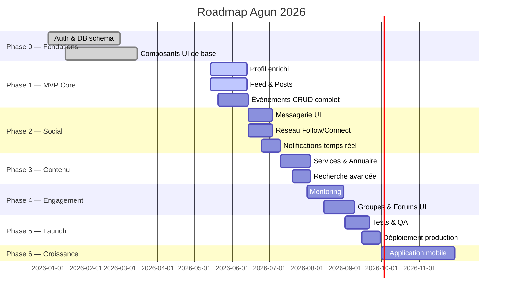

# Roadmap Projet — Agun

> Feuille de route complète du lancement MVP au produit final.
> Basée sur l'état réel du code au 14 Mai 2026.

---

## Vue d'ensemble

---

## Légende des statuts

| Icône | Statut |
|-------|--------|
| ✅ | Terminé |
| 🔄 | En cours |
| ⏳ | Prochainement |
| ❌ | Pas commencé |
| 🚫 | Bloqué |

---

## Phase 0 — Fondations ✅ TERMINÉE

> Ce qui a déjà été construit dans le projet AGUN.

### Checkpoint 0.1 — Infrastructure ✅
- [x] Projet Next.js 16 initialisé (TypeScript strict)
- [x] Supabase configuré (PostgreSQL + Auth + Storage)
- [x] TailwindCSS + système de design tokens
- [x] ESLint + TypeScript configurés
- [x] Variables d'environnement documentées

### Checkpoint 0.2 — Base de données ✅
- [x] 17+ tables PostgreSQL créées
- [x] Row Level Security (RLS) activé
- [x] Triggers d'auto-update des timestamps
- [x] Index de performance configurés
- [x] Migrations documentées

### Checkpoint 0.3 — Authentification ✅
- [x] Inscription (`POST /api/auth/signup`) — bcrypt 12 rounds
- [x] Connexion (`POST /api/auth/login`) — tokens 32 chars
- [x] Déconnexion avec révocation du token
- [x] Mot de passe oublié (Resend email)
- [x] Middleware de protection des routes

### Checkpoint 0.4 — Composants UI de base ✅
- [x] 115 composants React créés
- [x] 14 stores Zustand configurés
- [x] Layout global (header, nav, sidebar)
- [x] Système de notifications in-app
- [x] Gestion des favoris

---

## Phase 1 — MVP Core 🔄 EN COURS

> Objectif : une app utilisable par les premiers bêta-testeurs.
> **Deadline cible : 14 Juin 2026**

### Checkpoint 1.1 — Profil Enrichi 🔄
**Priorité : HAUTE** | Estimé : 1 semaine

- [ ] Ajouter champ `pays_origine[]` (multi-valeurs) au schéma
- [ ] Ajouter champ `nationalites[]` au schéma
- [ ] Ajouter champ `ethnicite[]` (optionnel, masqué par défaut)
- [ ] Ajouter champ `communaute_culturelle` au schéma
- [ ] Mettre à jour la page `/profile/edit` avec ces nouveaux champs
- [ ] Onboarding 4 étapes pour les nouveaux inscrits
- [ ] Badge "Profil incomplet" si champs obligatoires manquants
- [ ] Page profil public `/user/[id]` — layout final

**Critère de succès :** Un utilisateur peut renseigner ses 2 pays d'origine avec ethnicité et voir son profil public complet.

---

### Checkpoint 1.2 — Feed & Posts 🔄
**Priorité : HAUTE** | Estimé : 1 semaine

- [ ] Créer la table `posts` en base (si pas encore fait)
- [ ] API `POST /api/posts` — créer un post
- [ ] API `GET /api/posts` — lister le feed (paginé, 20/page)
- [ ] API `POST /api/posts/[id]/like` — toggle like
- [ ] API `POST /api/posts/[id]/comments` — ajouter commentaire
- [ ] UI : composant `PostCard` avec badge catégorie coloré
- [ ] UI : modal `CreatePostModal` — texte + image + catégorie
- [ ] UI : page `/app` avec les 2 onglets "Pour toi" / "Récents"
- [ ] UI : section commentaires sous chaque post
- [ ] Hashtags extraits automatiquement du contenu

**Critère de succès :** Un utilisateur peut créer un post, le voir dans le feed, et réagir aux posts des autres.

---

### Checkpoint 1.3 — Événements CRUD Complet ⏳
**Priorité : HAUTE** | Estimé : 1 semaine

- [ ] Page liste `/events` — cards avec image, badge type/prix
- [ ] Page détail `/events/[id]` — infos complètes + carte
- [ ] Formulaire de création complet (présentiel / en ligne / hybride)
- [ ] API `POST /api/events/[id]/participate` — s'inscrire/désinscrire
- [ ] Filtres : par ville, catégorie, gratuit, date
- [ ] Notifications automatiques : rappel J-7 et J-1
- [ ] Liste des participants sur la page détail

**Critère de succès :** Un utilisateur peut créer un événement et d'autres peuvent s'y inscrire et recevoir des rappels.

---

### Checkpoint 1.4 — Lancement Bêta Fermé ⏳
**Priorité : HAUTE**

- [ ] 10 utilisateurs bêta-testeurs recrutés
- [ ] Formulaire de feedback intégré dans l'app
- [ ] Dashboard analytics basique (inscriptions, posts, événements)
- [ ] Corrections des bugs critiques remontés
- [ ] README et guide d'installation à jour

**Critère de succès :** 10 personnes utilisent l'app pendant 1 semaine sans bug bloquant.

---

## Phase 2 — Social Graph ❌

> Objectif : les membres peuvent se connecter et communiquer.
> **Deadline cible : 15 Juillet 2026**

### Checkpoint 2.1 — Messagerie UI ❌
**Estimé : 2 semaines**
> L'API existe déjà (`/api/conversations`, `/api/chat`). Besoin de l'UI.

- [ ] Page `/chat` — liste des conversations (inbox)
- [ ] Page `/chat/[id]` — conversation ouverte
- [ ] Composant `MessageBubble` (envoyé/reçu)
- [ ] Indicateur "En train d'écrire…"
- [ ] Accusé de lecture (✓✓)
- [ ] Upload d'image dans les messages
- [ ] Notifications de nouveau message (badge sur l'icône)
- [ ] Intégration Supabase Realtime pour les messages temps réel

**Critère de succès :** Deux utilisateurs connectés peuvent échanger des messages en temps réel.

---

### Checkpoint 2.2 — Réseau Follow/Connect ❌
**Estimé : 1 semaine**

- [ ] Table `follows` (suivi asymétrique)
- [ ] Table `connections` (connexion symétrique + acceptation)
- [ ] API `POST /api/network/follow` — suivre/ne plus suivre
- [ ] API `POST /api/network/connect` — demande de connexion
- [ ] API `PATCH /api/network/connect/[id]` — accepter/refuser
- [ ] Page `/network` — suggestions de membres (avec raisons du matching)
- [ ] Mise à jour du profil : boutons Suivre + Se connecter
- [ ] Page `/network/connections` — mes connexions + abonnés

**Critère de succès :** Un utilisateur peut suivre 5 personnes et recevoir leurs posts dans son feed.

---

### Checkpoint 2.3 — Notifications Temps Réel ❌
**Estimé : 1 semaine**

- [ ] Connexion Supabase Realtime pour les notifications
- [ ] Types : nouveau follower, connexion, like, commentaire, message
- [ ] Badge compteur en temps réel sur la cloche
- [ ] Notifications push navigateur (Web Push API)
- [ ] Page `/notifications` — historique complet
- [ ] Préférences : quelles notifications activer

**Critère de succès :** Un utilisateur reçoit une notification immédiate quand quelqu'un like son post.

---

## Phase 3 — Contenu & Découverte ❌

> Objectif : l'annuaire des services de la diaspora.
> **Deadline cible : 10 Août 2026**

### Checkpoint 3.1 — Services & Annuaire ❌
**Estimé : 2 semaines**

- [ ] Page `/services` — annuaire avec carte + liste
- [ ] Fiche service complète avec galerie photos
- [ ] Système d'avis (note 1-5 + commentaire)
- [ ] Badge "Vérifié Diaspora"
- [ ] Filtre par catégorie, ville, note, disponible en ligne
- [ ] Langues parlées sur chaque fiche
- [ ] Bouton "Contacter" → messagerie Agun
- [ ] Section Petites Annonces (logement, emploi, objets, covoiturage)

**Critère de succès :** 20 fiches services créées et 5 avis déposés.

---

### Checkpoint 3.2 — Recherche Avancée ❌
**Estimé : 1 semaine**

- [ ] Recherche full-text Supabase (posts, events, services, membres)
- [ ] Filtres combinables (pays origine + ville + statut + domaine)
- [ ] Résultats unifiés par type
- [ ] Historique de recherche local
- [ ] Suggestions en temps réel (autocomplete)

---

## Phase 4 — Engagement Communautaire ❌

> Objectif : créer des liens durables entre membres.
> **Deadline cible : 10 Septembre 2026**

### Checkpoint 4.1 — Mentoring ❌
**Estimé : 2 semaines**

- [ ] Table `mentoring_profiles` + `mentoring_requests`
- [ ] Page "Trouver un mentor" avec filtres domaine/langue/dispo
- [ ] Profil mentor dédié (bio, domaines, avis)
- [ ] Flow demande → timer 72h → acceptation → conversation
- [ ] Tableau de bord mentor (demandes, mentorés actifs)
- [ ] Évaluation post-mentoring

**Critère de succès :** 5 binômes mentor/mentoré actifs.

---

### Checkpoint 4.2 — Groupes & Forums UI ❌
**Estimé : 2 semaines**
> L'API discussions existe. Besoin de l'UI.

- [ ] Page `/groups` — liste avec filtres (localisation, thème)
- [ ] Page groupe — membres, posts du groupe, événements liés
- [ ] Forum `/discussions` — liste + création de sujet
- [ ] Thread de discussion avec réponses imbriquées
- [ ] Rôles dans le groupe : admin / modérateur / membre
- [ ] Notifications liées aux groupes

---

## Phase 5 — Lancement Production ❌

> Objectif : app stable, déployée, métriquée.
> **Deadline cible : 30 Septembre 2026**

### Checkpoint 5.1 — Tests & QA ❌
- [ ] Tests unitaires (Jest) sur les algorithmes clés (matching, feed ranking)
- [ ] Tests d'intégration sur les 10 API routes les plus critiques
- [ ] Tests E2E (Playwright) sur les flows : inscription → post → événement
- [ ] Audit de sécurité (OWASP Top 10)
- [ ] Tests de performance (Lighthouse > 80)
- [ ] Test sur mobile (iOS + Android) via navigateur

### Checkpoint 5.2 — Déploiement Production ❌
- [ ] Choisir l'hébergeur (Vercel recommandé pour Next.js)
- [ ] Configurer le domaine agun.app (ou équivalent)
- [ ] Variables d'environnement production configurées
- [ ] CORS restreint aux origines connues
- [ ] Monitoring (Sentry pour les erreurs)
- [ ] Analytics (Plausible ou Posthog)
- [ ] Politique de confidentialité + CGU rédigées
- [ ] RGPD : consentement cookies, droit à l'oubli

### Checkpoint 5.3 — Lancement Public ❌
- [ ] 50 membres actifs à J+7
- [ ] 5 événements créés à J+14
- [ ] 10 fiches services à J+14
- [ ] Formulaire de feedback dans l'app
- [ ] Communication sur les réseaux sociaux

---

## Phase 6 — Croissance ❌

> Post-lancement. **À partir de Octobre 2026.**

### Checkpoint 6.1 — Application Mobile ❌
- [ ] Choisir entre React Native (Expo) ou Progressive Web App
- [ ] Navigation mobile native
- [ ] Notifications push mobiles
- [ ] Publication App Store + Google Play

### Checkpoint 6.2 — Internationalisation ❌
- [ ] i18n configuré (next-intl)
- [ ] Traductions : Français, Anglais, Portugais (diaspora lusophone)
- [ ] Détection automatique de la langue selon le pays

### Checkpoint 6.3 — Monétisation (optionnel) ❌
- [ ] Mise en avant payante pour les services (boost)
- [ ] Abonnement "Agun Pro" pour les entrepreneurs
- [ ] Ticketing intégré pour les événements payants

---

## Indicateurs Clés (KPIs)

| Indicateur | Objectif MVP | Objectif 6 mois |
|------------|-------------|-----------------|
| Inscriptions | 100 | 1 000 |
| Posts créés / semaine | 50 | 500 |
| Événements créés / mois | 10 | 100 |
| Messages échangés / jour | 20 | 500 |
| Taux de rétention J7 | 30% | 40% |
| Taux de rétention J30 | 15% | 25% |

---

## Prochaines Actions Immédiates (cette semaine)

1. **Profil** — Ajouter les champs `pays_origine[]` et `ethnicite[]` en base et dans le formulaire
2. **Feed** — Créer la table `posts` et le composant `PostCard`
3. **Événements** — Finaliser le formulaire de création et la page détail
4. **Bêta** — Recruter 5 premiers testeurs dans l'entourage

---

*Roadmap maintenue par l'équipe Agun — Mise à jour : 14 Mai 2026*
