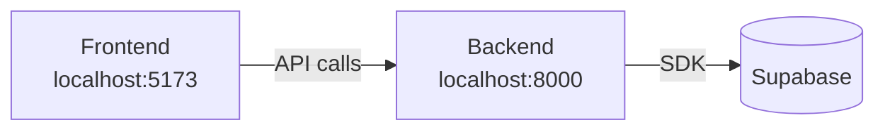

# Guide d'Installation — Agun

## Prérequis

Avant de commencer, assure-toi d'avoir installé :

| Outil | Version | Vérification |
|-------|---------|--------------|
| **Python** | 3.11+ | `python --version` |
| **Node.js** | 18+ | `node --version` |
| **npm** | 9+ | `npm --version` |
| **Git** | any | `git --version` |

Tu auras également besoin d'un **compte Supabase** (gratuit) : [supabase.com](https://supabase.com)

---

## 1. Cloner le projet

```bash
git clone https://github.com/Princeddn/Agun_web.git
cd Agun_web
```

---

## 2. Configurer Supabase

### 2.1 Créer un projet Supabase

1. Connecte-toi sur [app.supabase.com](https://app.supabase.com)
2. Crée un nouveau projet (choisis une région proche des utilisateurs cibles : Europe de l'Ouest ou Afrique de l'Ouest)
3. Note les informations suivantes depuis **Project Settings > API** :
   - `Project URL`
   - `anon public key`
   - `service_role key` ⚠️ (confidentiel — ne jamais committer)

### 2.2 Initialiser la base de données

Dans l'éditeur SQL de Supabase (**SQL Editor**), exécute dans cet ordre :

```sql
-- 1. Table des profils (liée à auth.users de Supabase)
CREATE TABLE profiles (
  id                   UUID PRIMARY KEY REFERENCES auth.users(id) ON DELETE CASCADE,
  username             TEXT UNIQUE NOT NULL,
  full_name            TEXT,
  avatar_url           TEXT,
  bio                  TEXT,
  country_of_origin    TEXT,
  country_of_residence TEXT,
  city                 TEXT,
  skills               TEXT[] DEFAULT '{}',
  is_mentor            BOOLEAN DEFAULT FALSE,
  created_at           TIMESTAMPTZ DEFAULT NOW(),
  updated_at           TIMESTAMPTZ DEFAULT NOW()
);

-- 2. Créer automatiquement un profil à chaque inscription
CREATE OR REPLACE FUNCTION handle_new_user()
RETURNS TRIGGER AS $$
BEGIN
  INSERT INTO profiles (id, username, full_name)
  VALUES (NEW.id, NEW.email, NEW.raw_user_meta_data->>'full_name');
  RETURN NEW;
END;
$$ LANGUAGE plpgsql SECURITY DEFINER;

CREATE TRIGGER on_auth_user_created
  AFTER INSERT ON auth.users
  FOR EACH ROW EXECUTE FUNCTION handle_new_user();

-- 3. Table des posts
CREATE TABLE posts (
  id          UUID PRIMARY KEY DEFAULT gen_random_uuid(),
  author_id   UUID REFERENCES profiles(id) ON DELETE CASCADE,
  content     TEXT NOT NULL,
  image_url   TEXT,
  category    TEXT CHECK (category IN ('experience', 'question', 'conseil', 'annonce')),
  likes_count INT DEFAULT 0,
  created_at  TIMESTAMPTZ DEFAULT NOW(),
  updated_at  TIMESTAMPTZ DEFAULT NOW()
);

-- 4. Table des commentaires
CREATE TABLE comments (
  id          UUID PRIMARY KEY DEFAULT gen_random_uuid(),
  post_id     UUID REFERENCES posts(id) ON DELETE CASCADE,
  author_id   UUID REFERENCES profiles(id) ON DELETE CASCADE,
  content     TEXT NOT NULL,
  created_at  TIMESTAMPTZ DEFAULT NOW()
);

-- 5. Table des événements
CREATE TABLE events (
  id          UUID PRIMARY KEY DEFAULT gen_random_uuid(),
  creator_id  UUID REFERENCES profiles(id) ON DELETE CASCADE,
  title       TEXT NOT NULL,
  description TEXT,
  image_url   TEXT,
  location    TEXT,
  city        TEXT,
  country     TEXT,
  event_date  TIMESTAMPTZ NOT NULL,
  link        TEXT,
  created_at  TIMESTAMPTZ DEFAULT NOW()
);

-- 6. Table des participants aux événements
CREATE TABLE event_participants (
  event_id UUID REFERENCES events(id) ON DELETE CASCADE,
  user_id  UUID REFERENCES profiles(id) ON DELETE CASCADE,
  PRIMARY KEY (event_id, user_id)
);
```

### 2.3 Configurer Row Level Security (RLS)

```sql
-- Activer RLS sur toutes les tables
ALTER TABLE profiles ENABLE ROW LEVEL SECURITY;
ALTER TABLE posts ENABLE ROW LEVEL SECURITY;
ALTER TABLE comments ENABLE ROW LEVEL SECURITY;
ALTER TABLE events ENABLE ROW LEVEL SECURITY;
ALTER TABLE event_participants ENABLE ROW LEVEL SECURITY;

-- Profils : lecture publique, modification par soi-même
CREATE POLICY "Profils visibles par tous" ON profiles FOR SELECT USING (true);
CREATE POLICY "Modifier son propre profil" ON profiles FOR UPDATE USING (auth.uid() = id);

-- Posts : lecture publique, création/suppression par l'auteur
CREATE POLICY "Posts visibles par tous" ON posts FOR SELECT USING (true);
CREATE POLICY "Créer un post" ON posts FOR INSERT WITH CHECK (auth.uid() = author_id);
CREATE POLICY "Supprimer son post" ON posts FOR DELETE USING (auth.uid() = author_id);

-- Événements : lecture publique, création par utilisateurs connectés
CREATE POLICY "Events visibles par tous" ON events FOR SELECT USING (true);
CREATE POLICY "Créer un event" ON events FOR INSERT WITH CHECK (auth.uid() = creator_id);
CREATE POLICY "Modifier son event" ON events FOR UPDATE USING (auth.uid() = creator_id);
```

---

## 3. Configurer le Backend

```bash
cd backend
```

### 3.1 Créer et activer l'environnement virtuel

```bash
# Windows
python -m venv venv
venv\Scripts\activate

# macOS / Linux
python -m venv venv
source venv/bin/activate
```

### 3.2 Installer les dépendances

```bash
pip install -r requirements.txt
```

### 3.3 Créer le fichier `.env`

```bash
cp .env.example .env
```

Édite `.env` avec tes vraies valeurs :

```env
# Supabase
SUPABASE_URL=https://XXXXXXXXXXXX.supabase.co
SUPABASE_ANON_KEY=eyJhbGciOiJIUzI1NiIsInR5cCI6IkpXVCJ9...
SUPABASE_SERVICE_ROLE_KEY=eyJhbGciOiJIUzI1NiIsInR5cCI6IkpXVCJ9...

# Sécurité (génère une clé aléatoire forte)
SECRET_KEY=une-cle-aleatoire-de-64-caracteres-minimum

# Application
ENVIRONMENT=development
BACKEND_CORS_ORIGINS=["http://localhost:5173"]
```

> **Générer un SECRET_KEY :**
> ```bash
> python -c "import secrets; print(secrets.token_hex(32))"
> ```

### 3.4 Lancer le backend

```bash
uvicorn app.main:app --reload --port 8000
```

Le backend sera disponible sur : `http://localhost:8000`
La documentation Swagger : `http://localhost:8000/docs`

---

## 4. Configurer le Frontend

```bash
cd ../frontend
```

### 4.1 Installer les dépendances

```bash
npm install
```

### 4.2 Créer le fichier `.env`

```bash
cp .env.example .env
```

Édite `.env` :

```env
VITE_API_URL=http://localhost:8000/api/v1
VITE_SUPABASE_URL=https://XXXXXXXXXXXX.supabase.co
VITE_SUPABASE_ANON_KEY=eyJhbGciOiJIUzI1NiIsInR5cCI6IkpXVCJ9...
```

### 4.3 Lancer le frontend

```bash
npm run dev
```

Le frontend sera disponible sur : `http://localhost:5173`

---

## 5. Vérifier que tout fonctionne



Checklist de vérification :

- [ ] `http://localhost:8000/health` renvoie `{"status": "ok"}`
- [ ] `http://localhost:8000/docs` affiche la documentation Swagger
- [ ] `http://localhost:5173` affiche la page d'accueil sans erreur console
- [ ] L'inscription d'un utilisateur de test fonctionne

---

## Variables d'environnement — Référence complète

### Backend (`backend/.env`)

| Variable | Obligatoire | Description |
|----------|-------------|-------------|
| `SUPABASE_URL` | ✅ | URL du projet Supabase |
| `SUPABASE_ANON_KEY` | ✅ | Clé publique Supabase |
| `SUPABASE_SERVICE_ROLE_KEY` | ✅ | Clé admin Supabase (ne jamais exposer) |
| `SECRET_KEY` | ✅ | Clé secrète pour la signature JWT |
| `ENVIRONMENT` | ✅ | `development` ou `production` |
| `BACKEND_CORS_ORIGINS` | ✅ | Liste JSON des origines autorisées |

### Frontend (`frontend/.env`)

| Variable | Obligatoire | Description |
|----------|-------------|-------------|
| `VITE_API_URL` | ✅ | URL de base du backend |
| `VITE_SUPABASE_URL` | ✅ | URL du projet Supabase |
| `VITE_SUPABASE_ANON_KEY` | ✅ | Clé publique Supabase |

---

## Commandes utiles

```bash
# Backend — lancer avec rechargement auto
uvicorn app.main:app --reload

# Backend — lancer les tests (quand disponibles)
pytest

# Frontend — lancer en dev
npm run dev

# Frontend — builder pour la production
npm run build

# Frontend — prévisualiser le build de production
npm run preview
```

---

## Problèmes courants

### "CORS error" dans la console du navigateur
→ Vérifier que `BACKEND_CORS_ORIGINS` dans le `.env` backend contient bien `http://localhost:5173`

### "Invalid API key" depuis Supabase
→ Vérifier que `SUPABASE_ANON_KEY` dans le `.env` frontend correspond bien à la clé `anon public` de ton projet Supabase (et non la `service_role`).

### "Module not found" au lancement du backend
→ S'assurer que l'environnement virtuel est bien activé (`venv\Scripts\activate` sur Windows)

---

*Document maintenu par l'équipe technique — Dernière mise à jour : Mai 2026*
