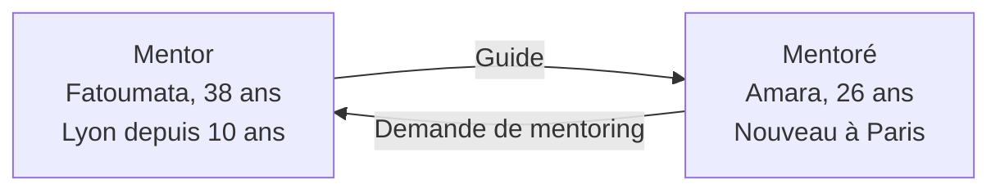
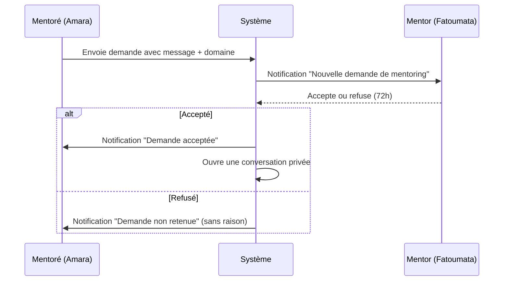

# Feature — Mentoring

## Objectif

Connecter les membres expérimentés de la diaspora (les "anciens") avec ceux qui arrivent ou qui ont besoin de guidance (les "nouveaux"). Le mentoring est l'une des valeurs fondamentales d'Agun : l'entraide intergénérationnelle et interculturelle.

---

## Priorité : V3

---

## Concept



---

## Fonctionnalités Détaillées

### 1. Devenir Mentor

Tout utilisateur peut proposer ses services de mentor. Il doit compléter un profil mentor en plus de son profil standard.

| Champ | Type | Obligatoire | Description |
|-------|------|-------------|-------------|
| Domaines d'expertise | Tableau (max 5) | Oui | Voir liste ci-dessous |
| Années d'expérience | Entier | Oui | Dans le pays de résidence |
| Bio mentor | Texte (max 500) | Oui | Pourquoi tu veux être mentor |
| Langues de mentoring | Tableau | Oui | Ex: `["Français", "Wolof"]` |
| Nombre max de mentorés | Entier (1-5) | Oui | Défaut : 2 |
| Disponibilité | Enum | Oui | `disponible`, `complet`, `pause` |
| Mode | Tableau | Oui | `en_ligne`, `présentiel`, `les_deux` |

**Domaines de mentoring :**
```
integration        — Intégration dans le pays d'accueil, démarches admin
etudes             — Orientation, financement, vie étudiante
emploi             — Recherche d'emploi, CV, entretiens, reconversion
entrepreneuriat    — Créer et gérer un business
finance            — Gestion budget, épargne, investissement
sante              — Naviguer le système de santé
logement           — Trouver un logement, comprendre les droits
culture            — S'adapter tout en préservant ses racines
bien_etre          — Gestion du stress, isolement, santé mentale
informatique_tech  — Carrière tech, reconversion numérique
```

---

### 2. Trouver un Mentor

**Page "Trouver un mentor"**

Filtres de recherche :
- Domaine d'expertise
- Pays / Ville du mentor
- Langue de mentoring
- Origines du mentor (pour trouver quelqu'un qui comprend ta culture)
- Disponibilité

**Fiche d'un mentor :**
- Photo + nom + statut + origines
- Domaines d'expertise (tags)
- Bio mentor
- Langues parlées
- Nombre de mentorés actuels / max
- Avis des anciens mentorés
- Bouton [Demander un mentoring]

---

### 3. Processus de Demande de Mentoring



**Contenu de la demande :**
- Domaine souhaité (parmi les domaines du mentor)
- Message de présentation (max 300 car.) : Qui tu es, pourquoi tu demandes ce mentor
- Le mentor a 72h pour accepter ou refuser. Après, la demande est archivée automatiquement.

---

### 4. Relation de Mentoring

Une fois acceptée :
- Une conversation privée dédiée est créée automatiquement
- Le mentor peut proposer des séances (dates, format, durée)
- Le mentoré peut marquer la relation comme "terminée" après sa période

**Durée recommandée :** 3 à 6 mois (non contraignant).

---

### 5. Évaluation du Mentoring

À la fin de la relation, le mentoré peut laisser un avis sur le mentor :
- Note : 1 à 5 étoiles
- Commentaire public (visible sur la fiche du mentor)
- Ce qui a été utile (checklist)
- Recommanderait ce mentor : Oui / Non

---

### 6. Tableau de Bord Mentor

- Demandes en attente
- Mentorés actuels
- Historique des mentorings terminés
- Note moyenne + avis reçus
- Changer sa disponibilité

---

## Règles Métier

- Un mentoré ne peut avoir qu'un seul mentor actif à la fois par domaine.
- Un mentor ne peut pas demander à être mentoré par l'un de ses mentorés actuels.
- Si le mentor ne répond pas dans 72h, sa disponibilité passe automatiquement en `pause` après 3 demandes ignorées consécutives.
- Le mentoring est 100% gratuit (pas de transaction dans l'app).

---

## Tables de Base de Données Associées

- `mentoring_profiles` — profil mentor
- `mentoring_requests` — demandes de mentoring
- `mentoring_reviews` — avis sur les mentors

→ Voir [docs/DATABASE.md](../DATABASE.md) pour le schéma SQL complet.
