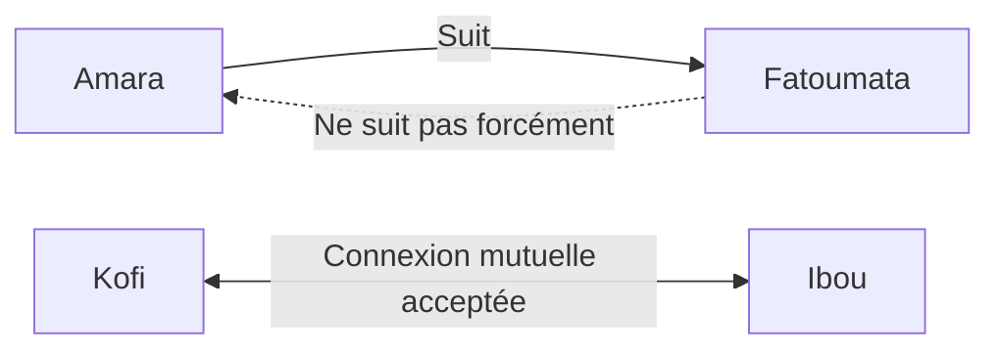

# Feature — Réseau Social & Mise en Relation

## Objectif

Agun combine deux modèles de réseau social complémentaires : le **suivi** (comme Twitter, asymétrique) et la **connexion** (comme LinkedIn, symétrique avec acceptation). Ensemble, ils permettent à la fois de s'informer auprès d'influenceurs de la communauté et de construire un réseau de confiance mutuelle.

---

## Priorité : MVP (V1)

---

## Les deux systèmes de relation



| | Suivre (Follow) | Se connecter |
|-|-----------------|--------------|
| **Modèle** | Asymétrique | Symétrique |
| **Acceptation requise** | Non | Oui |
| **Inspiration** | Twitter / Instagram | LinkedIn |
| **Usage** | Suivre du contenu | Construire un réseau de confiance |
| **Avantage** | Voir les posts dans le feed | Accès à la messagerie, recommandations prioritaires |

---

## Fonctionnalités Détaillées

### 1. Système de Suivi (Follow)

**Suivre un membre :**
- Bouton [Suivre] sur la page profil ou dans les suggestions
- L'abonnement est immédiat, sans validation
- Les posts du suivi apparaissent dans son feed
- Le membre suivi reçoit une notification

**Ne plus suivre :**
- Bouton [Ne plus suivre] — sans notification à l'autre
- Les posts de l'ex-suivi disparaissent progressivement du feed

**Compteurs affichés sur le profil :**
- `X Abonnés` (nombre de personnes qui te suivent)
- `X Abonnements` (nombre de personnes que tu suis)

---

### 2. Système de Connexion (Connect)

**Envoyer une demande de connexion :**
- Bouton [Se connecter] + message d'introduction optionnel (max 200 car.)
- La demande reste `en attente` jusqu'à acceptation

**Statuts d'une connexion :**
```
pending    — Demande envoyée, en attente de réponse
accepted   — Connexion établie (accès messagerie, recommandations)
declined   — Refusée (discrètement — pas de notification de refus)
blocked    — L'utilisateur bloqué ne peut plus voir le profil
```

**Avantages d'une connexion acceptée :**
- Accès à la messagerie privée
- Apparition prioritaire dans les recommandations de l'autre
- Contenu "Connexions uniquement" visible

---

### 3. Système de Recommandation (Matching)

**Page "Personnes à connaître"**

L'algorithme propose des profils selon plusieurs critères pondérés :

| Critère | Points |
|---------|--------|
| Même pays d'origine (exact) | +50 |
| Même ethnie / communauté | +40 |
| Même ville de résidence | +35 |
| Centres d'intérêt communs (par item) | +10 |
| Même domaine d'études / professionnel | +20 |
| Même statut (étudiant + étudiant) | +10 |
| Connexions en commun (par connexion) | +15 |
| A participé aux mêmes événements | +25 |

Les profils avec le score le plus élevé sont affichés en premier.

**Affichage d'une suggestion :**
- Photo + Nom + Statut + Ville
- Tags de raison : `"Même pays d'origine"`, `"3 connexions en commun"`, `"Mêmes centres d'intérêt"`
- Boutons [Suivre] et [Se connecter]

**Recherche manuelle :**
Barre de recherche avec filtres :
- Pays d'origine
- Pays de résidence / Ville
- Ethnie / Communauté
- Statut (étudiant, entrepreneur, etc.)
- Domaine professionnel / d'études
- Centre d'intérêt
- Est mentor

---

### 4. Gestion des Relations

**Mes connexions :**
- Liste de toutes les connexions acceptées
- Recherche dans ses connexions
- Supprimer une connexion

**Mes abonnements / abonnés :**
- Liste des personnes suivies et des abonnés
- Retirer un abonné (sans le notifier)

**Bloquer un utilisateur :**
- Accessible depuis un profil ou un signalement
- Le compte bloqué ne peut plus :
  - Voir ton profil
  - Envoyer des messages
  - Voir tes posts
- La connexion / le suivi est automatiquement supprimé

---

### 5. Notifications Réseau

| Déclencheur | Notification |
|-------------|--------------|
| Quelqu'un te suit | "Untel a commencé à vous suivre" |
| Demande de connexion reçue | "Untel souhaite se connecter" |
| Connexion acceptée | "Untel a accepté votre demande de connexion" |
| Suggestion de profil | "Vous avez X connexions en commun avec Untel" |

---

## Règles Métier

- On ne peut pas se suivre soi-même.
- On ne peut pas envoyer plus de 20 demandes de connexion par jour (anti-spam).
- Un utilisateur bloqué n'apparaît jamais dans les suggestions ou résultats de recherche.
- Si une connexion est supprimée, une nouvelle demande peut être envoyée après 7 jours.
- Les scores de matching sont recalculés toutes les 24h (tâche en arrière-plan).

---

## Tables de Base de Données Associées

- `follows` — relations de suivi asymétriques
- `connections` — demandes et connexions mutuelles
- `blocked_users` — utilisateurs bloqués
- `user_recommendations` — scores de matching précalculés

→ Voir [docs/DATABASE.md](../DATABASE.md) pour le schéma SQL complet.
