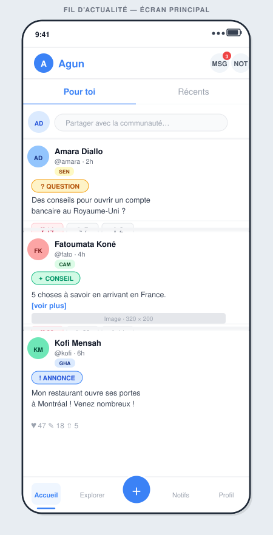
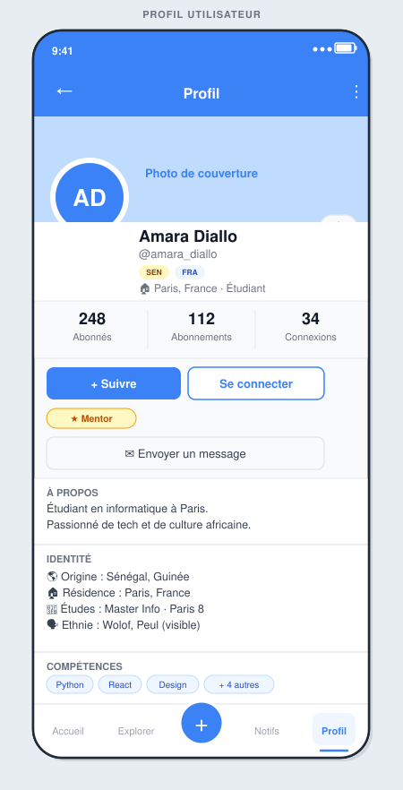
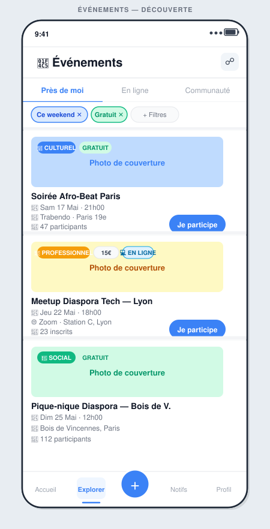
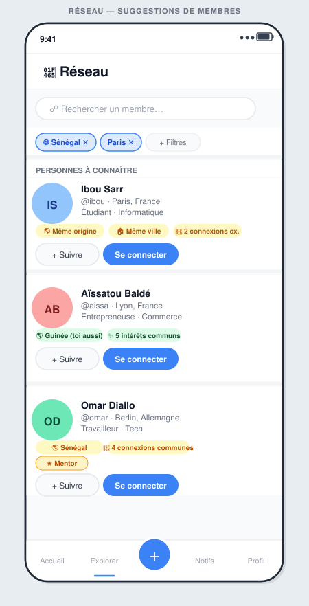
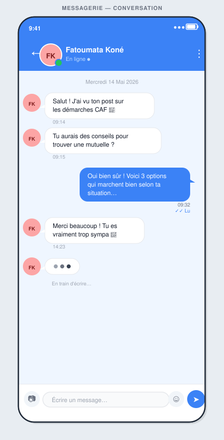

# Wireframes UI — Agun

Maquettes basse fidélité des écrans principaux. Format **SVG** — s'affiche directement dans VS Code, GitHub et les navigateurs.

---

## Fil d'Actualité

**Éléments clés :**
- Header avec logo Agun + compteur de messages non lus
- Onglets "Pour toi" (algorithmique) / "Récents" (chronologique)
- Barre de création rapide en haut du feed
- Post cards avec badge coloré par catégorie (❓ Question · ✦ Conseil · ! Annonce)
- FAB "+" central pour créer un post
- 5 sections dans la navigation : Accueil, Explorer, Créer, Notifs, Profil

---

## Profil Utilisateur

**Éléments clés :**
- Photo de couverture + avatar superposé (style Instagram/LinkedIn)
- Drapeaux représentant les origines multiples (SEN, FRA)
- Compteurs : Abonnés / Abonnements / Connexions
- Deux boutons d'action : **Suivre** (asymétrique) + **Se connecter** (symétrique)
- Badge **Mentor** affiché si l'utilisateur est mentor
- Section Identité : origines, résidence, études, ethnie (optionnel)
- Tags compétences filtrables

---

## Événements

**Éléments clés :**
- 3 onglets : Près de moi · En ligne · Communauté
- Filtres actifs (tags supprimables)
- Cards événements avec image de couverture + badges type + prix
- Couleurs par catégorie : Bleu = Culturel, Jaune = Professionnel, Vert = Social
- Badge "GRATUIT" ou prix affiché clairement
- Bouton "Je participe" directement sur la card

---

## Réseau — Suggestions

**Éléments clés :**
- Barre de recherche universelle
- Filtres actifs : Pays d'origine, Ville, Statut
- Cards de suggestion avec **raisons du matching** en tags jaunes
- Badge ⭐ Mentor visible sur les profils mentors
- Double CTA : **+ Suivre** (léger) + **Se connecter** (principal)
- Score de matching non affiché à l'utilisateur (transparent)

---

## Messagerie — Conversation

**Éléments clés :**
- Header bleu avec avatar + indicateur "En ligne" ●
- Messages reçus à gauche (bulle blanche), envoyés à droite (bulle bleue)
- Indicateur de frappe animé (3 points)
- Double coche bleue "Lu" pour l'accusé de lecture
- Barre d'input fixe en bas avec : attachement · zone texte · emoji · bouton envoi

---

## Prochains écrans à designer

| Écran | Feature | Priorité |
|-------|---------|----------|
| Créer un Post | Feed | MVP |
| Détail Événement | Événements | MVP |
| Demande de Connexion (popup) | Réseau | MVP |
| Inbox Messages | Messagerie | MVP |
| Onboarding (4 étapes) | Profils | MVP |
| Annuaire Services | Services | V2 |
| Fiche Mentor | Mentoring | V3 |
